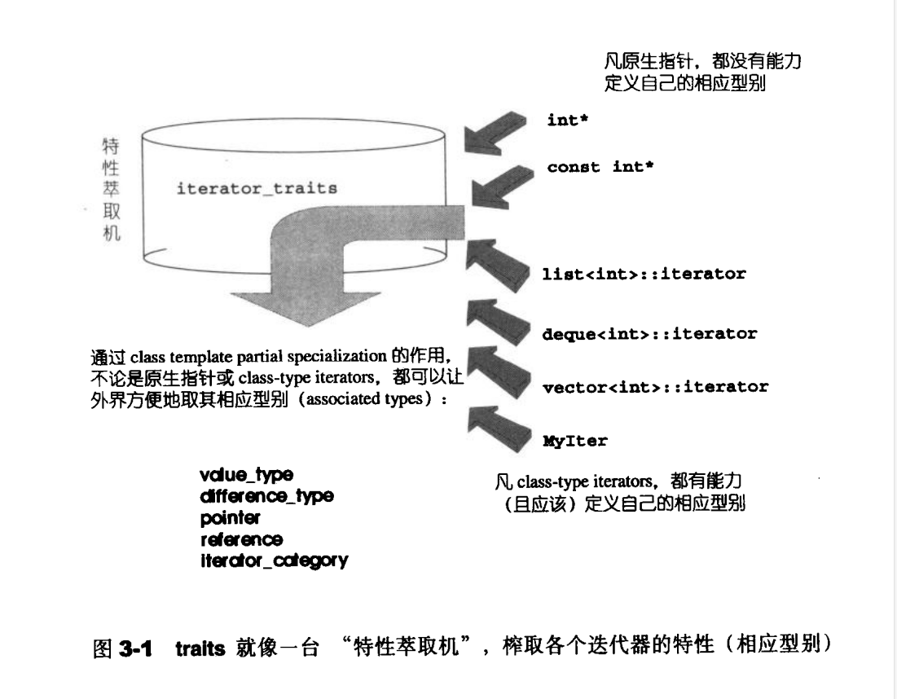
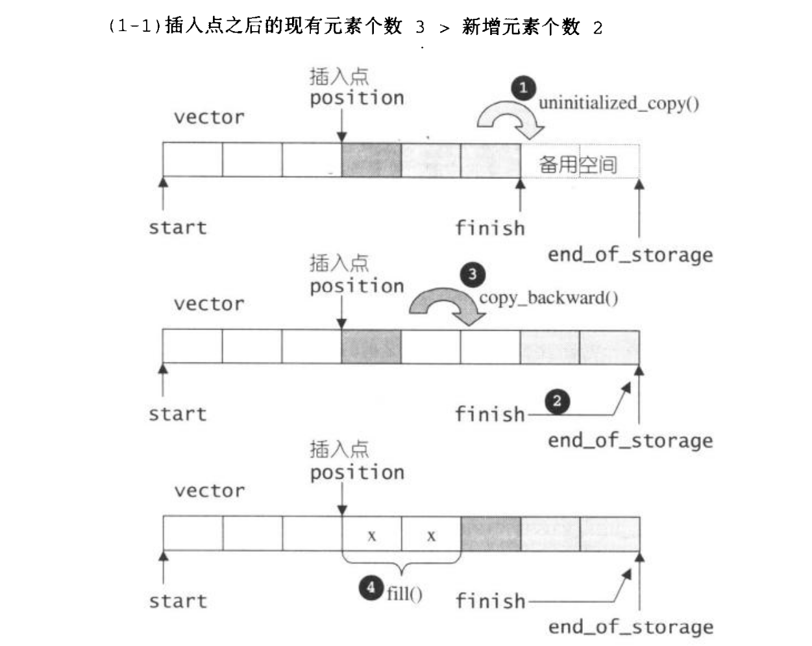
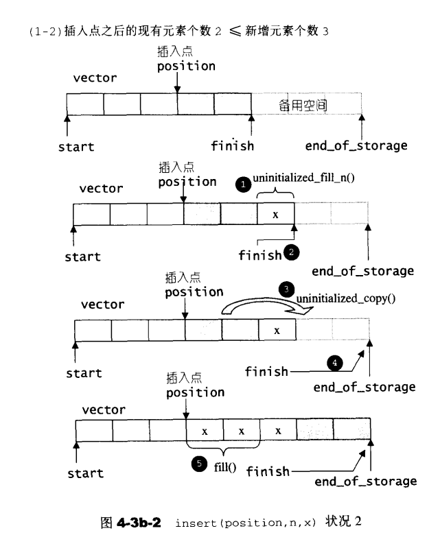
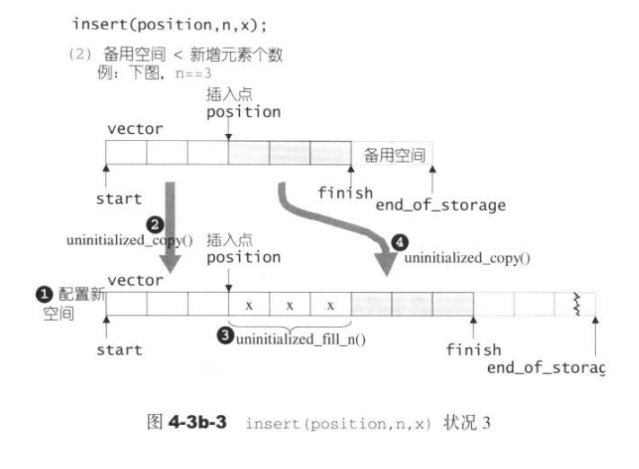
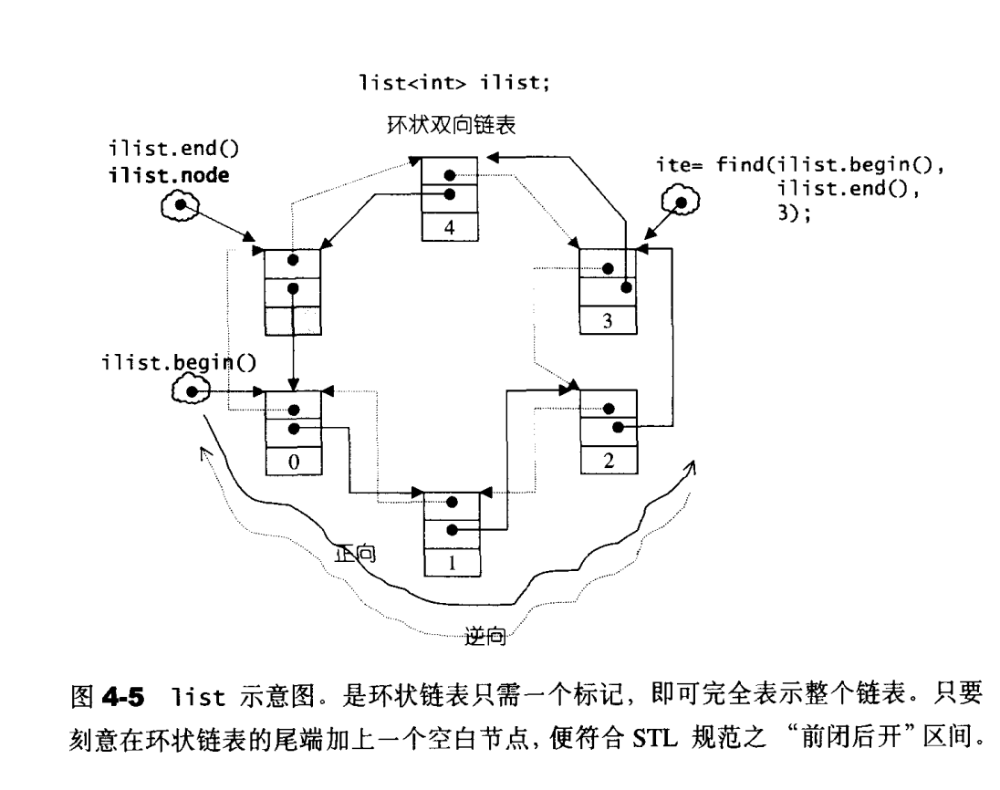
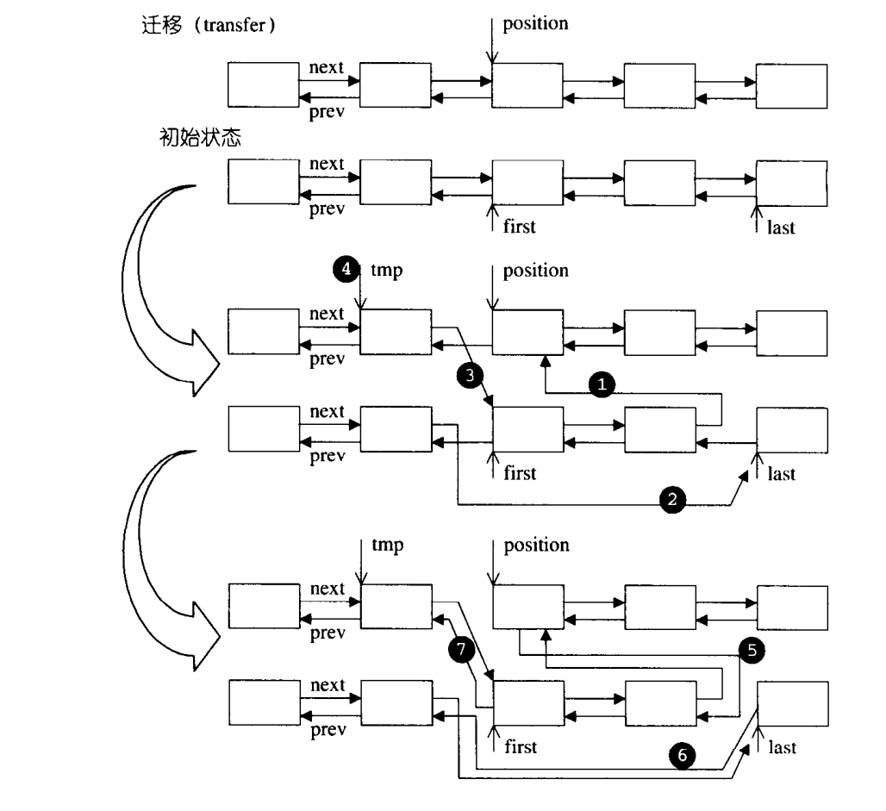

# STL概论
## 模板的作用
模板可以用来特化,指定下一个参数的类型.很多有关类外的类的类型的事情都可以使用模板.

## 临时对象的产生和应用
**制造临时对象**
在型别对象后面直接加一对小括号,并指定初值.STL最常将此技巧应用于仿函数与算法的搭配上.
特别是仿函数,经常被用于临时对象的产生和使用.

## 静态常量整数成员直接在函数内部初始化

## 前闭后开区间表示法[)
任何一个STL算法,都需要获得由一对迭代器所标示的区间,用于表示操作范围.这一对迭代器所标示的是个所谓的前闭后开区间.

# 空间配置器
空间配置器不仅在分配内容,甚至可以直接读和取磁盘和其他辅助介质.

## 具备次配置力的SGI空间配置器
SGI STL的每一个容器都已经指定其缺省的空间配置器未alloc.比如下面的vector声明:
```C++
	template <class T, class Alloc = alloc>		// 缺省使用alloc为配置器
	class vector {};
```
### SGI 特殊的空间配置器, std::alloc
为了精密分工,STL allocator将两个阶段操作区分开来.
内存配置操作由alloc::allocate()负责,内存释放操作由alloc::deallocate()负责.
对象构造操作由::construct()负责,对象析构操作由::destroy()负责.

### 构造和析构基本工具: construct() 和 destroy()
> The  destructor for class T is trivial if all of the following is true:
> 1. The destructor is not user-provided.
> 2. The destructor is not virtual 
> 3. All direct base classes have trivial destructors.
> 4. All non-static date members of class type (or array of class type) have trivial destructors
> A trivialk destructor is a destructor that performs no action. Objects with trivial destryctors don`t require a delete-expression and mat be disposed of by simply deallocating their storage . All data types compatible with the C language are trivially destructible.

上述construct()接受一个指针 p 和一个初值 value, 该函数被用于将初值设定到指针指定的空间上.
destroy() 会首先利用 value_type()获得迭代器所指对象的类型,再使用__type_traits<T>判断该类别的析构函数是否trivial.若是(__true_type),就什么都不做直接结束.

### 空间的配置和释放

对象构造前的空间配置和对象析构后的空间释放的设计考虑如下:

* 向system heap要求空间
* 考虑多线程的状态
* 考虑内存空间不足时的措施
* 考虑过多"小型区块"可能造成的内存碎片问题

针对内存破碎,SGI设计了双层级配置器.  

第一级配置器直接使用malloc()和free()

第二级配置器因地制宜:当配置区块>128bytes,视之为"足够大",就调用第一级配置器.当配置区块<128bytes,视之为"过小".采用复杂的memory pooling的整理方式.

整个设计是只开放第一级配置器,还是同时开放第二级配置器,取决于 __USE_MALLOC是否被定义:

```c++
# ifdef __USE_MALLOC
...
typedef __malloc_alloc_template<0> malloc_alloc;
typedef malloc_alloc alloc;												// 令 alloc 为第一级配置器

# else
typedef __default_alloc_template<__NODE_ALLOCATOR_THREAD, 0> alloc;		    // 第二级配置器

# endif  /*__USE_MALLOC*/
/*
	alloc 不接受任何template型别参数	
*/
```

无论alloc被配置为第一级配置器还是第二级配置器,SGI还会为它再包装一个接口如下,使配置器的接口能够符合STL的规格:

```c++
template<class T, class Alloc>
class simple_alloc 
{
    public:
    static T* allocate(size_t n)
    { return 0 == n ? 0 : (T*) Alloc::allocate(n * sizeof(T) ); }
    static T* allocate(void)
    { return (T*) Alloc::allocate(sizeof (T) ); }
    static void deallocate(T* p, size_t n)
    { 
        if (0 != n) 
    		Alloc::deallocate(p, n * sizeof(T) );
    }
    static void deallocate(T* p)
    { Alloc:deallocate(p, sizeof (T) ); }
}
```

### 第一级配置器 __malloc_alloc_template剖析

第一级配置器以malloc(),free(),realloc()等C函数执行实际的内存配置,释放,重配置操作,并实现出类似C++ new-handler 的机制.

> 第一级配置器不能直接运用 C++ new-handler 机制，因为它不用::operator new来配置内存。
>
> C++ new-handler机制是：
>
> 我可以要求系统在内存配置需求无法被满足的时候，调用一个我指定的函数。

>​	SGI第一级配置器的allocate()和realloc()都是在调用malloc()和realloc()不成功后，改调用oom_realloc()和oom_realloc()，这两个都有内循环，不断调用“内存不足处理例程”(在这个例程里面会一直尝试释放内存)，期望在某次调用后，能够获得足够的内存。
>
>​	但是如果没有“内存不足处理例程”，oom_realloc()和oom_realloc()会直接丢出bad_alloc异常信息，或者使用exit(1)强行终止程序.
>
>​	所以设计和和设定"内存不足处理例程"是客端的责任

### 第二级配置器 __default_alloc_template 剖析

SGI第二级配置器的做法是次层配置:对于<128bytes的区块,以内存池管理.每次配置一大块内存,并维护对应的自由链表.链表的每个节点如下:

```c++
union obj
{
    union obj* free)list_link;
    char client_data[1]; 			
}
```

在本例中,维护的区块大小为free-list={8,16,..,128},也就是说,一共会有16个free-list;

### 空间配置函数allocate()

allocate()是__default_alloc_template的标准接口.

```c++
static void* allcoate(size_t n)						// n > 0
{
    obj* volatile* my_free_list;					// volatile 保证队特殊地址的稳定访问
    obj* result;
    
    // 大于128, 调用第一级配置器
    if ( n > (size_t) __MAX_BYTES)
    {
        return(malloc_alloc::allocate(n));
    }
    // 寻找16个free list 中最适合的一个
    my_free_list = free_list + FREELIST_INDEX(n);
    result = *my_free_list;
    if (result = 0)
    {
        // 没找到可用的free list,准备重新填充free list
        void* r = refill(ROUND_UP(n));
        return r;
    }
    
    // 调整 free list
    *my_free_list= result -> free_list_link;
    return (result);
}
```

### 空间释放函数

没啥好说的

### 重新填充fill lists


## 内存基本处理工具

STL的五个全局函数有：

1. construct()

2. destroy()

3. uninitialized_copy()

4. uninitialized_fill()

   同 5.

   针对 **char*** 和 **wchar_t***   两种类型， 可以使用最有效率的做法memove（直接移动内存内容）来完成复制内容

   ```c++
   // uninitialized_copy()针对 char* 和 wchar_t* 的特化版本
   inline char* uninitialized_copy(const char* first, const char* last, char* result)
   {
       memove(result, first, last - first);
       return result + (last - first);
   }
   
   inline wchar_t* uninitialized_copy(const wchar_t * first, const wchar_t * last, wchar_t * result)
   {
       memove(result, first, sizeof(wchar_t) * (last - first));
       return result + (last - first);     // ? 没有 sizeof
   }
   ```

5. uninitialized_fill_n()

   ```c++
   // 这个函数的进行逻辑：萃取迭代器first的value type，判断该型别是否为POD型别。（POD， 标量类型或者传统的C结构类型）
   template <class ForwardIterator, class Size, class T>
   inline ForwardIterator uninitialized_fill_n(ForwardIterator first, Size n, const T& x)
   {
       return __uninitialized_fill_n(first, n, x , value_type(first));
   }
   
   template <class ForwardIterator, class Size, class T, class T1>
   inline ForwardIterator __uninitialized_fill_n(ForwardIterator first, Size n, const T& x, T1*)
   {
       typedef typename __type_traits<T1>::is_POD_type is_POD;
       return __uninitialized_fill_n_aux(first, n, x, is_POD());
   }
   
   // 如果是 copy construction 等同于 assignment， 而且
   // destructor 是 trivial, 以下就有效
   // 如果是 POD 型别， 执行流程就会转进到以下函数
   // 这是由 function template 的参数推导机制而得(?)
   template <class ForwardIterator, class Size, class T>
   inline ForwardIterator ininitialized_fill_n(ForwardIterator first, Size n, const T& x)
   {
       __uninitializaed_fill_n_aux(ForwardIterator first, Size n, const T& x, __true_type)
       {
           return fill_n(first, n, x);
       }
   }
   
   // 如果不是 POD 型别， 执行流程就会转进到以下函数
   // 这是由 function template 的参数推导机制而得(?)
   template <class ForwardIterator, class Size, class T>
   ForwardIterator __uninitialized_fill_n_zux(ForwardIterator first, Size n, const T& x, __false_type)
   {
       ForwardIterator cur = first;
       for ( ; n > 0; --n, ++cur)  
           construct(&*cur, x);		// 只能一个一个构造， 不能批量进行
       return cur;
   }
   ```

   # 迭代器概念 与 traits 编程技法

   

   ## 迭代器 >= smart pointer

   一般情况下为了避免过多的暴露容器细节，会把迭代器也交由容器的设计者来实现。

   

   ## 迭代器相应型别

   利用 function template 的参数推导机制， 例如

   ```c++
   template <class I, class T>
   void func_impl(I iter, T t)
   {
       T tmp;
       // ... 这里完成func（） 应该做的全部工作
   }
   
   template <class I>
   inline void func(I iter)
   {
       func_impl(iter, *iter);
   }
   
   int main() {
       int i;
        func(&i);
   }
   ```

   ## Traits 编程技法

   上述技巧有限，如果 value type 必须用于函数的传回值，它就失效了。

   声明内嵌型别可以解决这个问题。

   ```c++
   template <class T>
   struct MyIter
   {
       typedef T value_type;
       T* ptr;
       MyIter(T* p=0) : ptr(p) {}
       T& operator* () const { return *ptr; }
   };
   
   template <class I>
   typename I::value_type func( I iter)
   {
       return *iter;
   }
   
   
   
   int main() {
       // ...
       MyIter<int> iter(new int(8));
       cout << func(iter);
   }
   ```

    func()的回返类型必须加上关键词typename，因为T是一个template参数，在他被编译器具现化之前，编译器对T一无所知，也就是说，编译器不知道 MyIter<T>::value_type代表的是一个型别还是一个member function 还是一个 data member。

   但是这里有个隐晦的陷阱：并不是所有迭代器都是 class type。比如原声指针。如果不是 class type,就不能定义内嵌型别。
   
   针对这种情况，使用 **偏特化**。
   
   其实这里偏特化的作用就是特性萃取器。
   
   
   
   
   
   ```c++
   // 偏特化
   template <class T>
   struct iterator_traits<T*>
   {
       typedef T value_type;
   };
   
   template <class I>
   typename iterator_traits<I>::value_type
   func(I ite)
   { return *ite; }
   ```
   
   注意，对const I 类型的同样要另起偏特化的函数。
   
   STL里面定义如下：
   
   ```C++
   template<typename _Tp>
     struct iterator_traits<_Tp*>
     {
       typedef random_access_iterator_tag iterator_category;
       typedef _Tp                         value_type;
       typedef ptrdiff_t                   difference_type;
       typedef _Tp*                        pointer;
       typedef _Tp&                        reference;
     };
   ```
   
   ### difference type
   
   difference type用于表示两个迭代器之间的距离。
   
   使用方式：
   
   ```c++
   typename iterator_traits<I>::value_type
   ```
   
   ### reference type
   
   ### pointer type
   
   ### iterator_category
   
   其实就是迭代器的前进和后退。
   
   以 advance() 为例
   
   设计如下：如果 traits 有能力萃取出迭代器的种类，我们可以利用这个“迭代器类型”相应型别作为 advanced()的第三参数。这个相应型别必须是一个class type，不能只是数值号码之类的东西（因为编译器要使用traits并仰赖它（一个型别））来进行重载决议。
   
   
   
   ```c++
   // 五个作为标记使用的型别（tag types)
   struct input_iterator_tag {};
   struct output_iterator_tag {};
   struct forward_iterator_tag : public input_iterator_tag {};
   struct bidirectional_iterator_tag : public forward_iterator_tag {};
   struct random_access_iterator_tag : public bidirectional_iterator_tag {};
   
   template <class ForwardIterator, class Distance>
   inline void __advance(ForwardIterator& i, Distance n,
                         input_iterator_tag)
   {
       while (n--) ++i;
   }
   
   template <class ForwardIterator, class Distance>
   inline void __advance(ForwardIterator& i, Distance n,
                         forward_iterator_tag)
   {
       advance(i, n, input_iterator_tag());
   }
   
   template <class BidiectionIterator, class Distance>
   inline void __advance(BidiectionIterator& i, Distance n,
                         bidirectional_iterator_tag)
   {
       // 双向， 逐一前进
       if (n >= 0)
           while (n--) ++i;
       else
           while (n++) --i;
   }
   
   template <class RandomAccessIterator, class Distance>
   inline void __advance(RandomAccessIterator& i, Distance n,
                         random_access_iterator_tag)
   {
       // 双向， 跳跃前进
       i += n;
   }
   
   /*
    * 注意上述语法， 每个__advance() 的最后一个参数都只声明型别，并未指定参数名称，
    * 因为它纯粹用来激活重载机制，函数中根本不会使用到该参数。
    * */
   
   // 下面是一个对外开放的上层控制接口，调用上述各个重载的__advance()
   template <class InputIterator, class Distance>
   inline void advance(InputIterator& i, Distance n)
   {
       __advance(i, n, 
                 iterator_traits<InputIterator>::iterator_category());
   }
   ```
   
   
   
   ## std::iterator 的保证
   
   STL 提供了一个 iterators class 。如果每个新设计的迭代器都继承自它，就可保证STL所需要的规范。
   
   # 序列式容器
   
   ## 容器分类
   
   ### 序列式容器
   
   序列式容器指的是元素都可序，但未必有序。
   
   ## vector
   
   vector是动态空间，随着元素的加入，其内部机制会自动扩充空间来容纳新元素。
   
   vector的实现，关键在于**对大小的控制**和**重新配置时数据移动的效率**。
   
   ### vector的数据结构
   
   vector的数据结构：线性连续空间。
   
   所谓动态增加大小，是以原大小的两倍另外配置一块较大空间，然后将原内容拷贝过来，然后才在原内容之后构造新元素并且**释放原空间**。
   
   **对vector的所有操作，一旦引起空间重新配置，指向原vector的所有迭代器就都失效了。**
   
   ### 操作：pop_back,erase,clear,insert
   
   inert图示：
   
   
   
   
   
   ## list
   
   list的insert和splice操作都不会造成原有的list迭代器失效。
   
   list其实是一个环状双向链表。



### constructor, push_back, insert

list提供有很多 constructor，其中一个是 default constructor，允许我们不指定任何参数作出一个空的list出来。

当我们使用 push_back() 将新元素插入于 list 尾端时，此函数内部调用 insert()：

```c++
void push_back(const T& x) { insert(end(), x); }
```

list 内部提供一个所谓的迁移操作（transfer)：将某连续范围的元素迁移到某个特定位置之前。



merge(), reverse(), sort() 都是经由 transfer() 实现的。

>list 不能使用 STL算法 sort() ， 必须使用自己的 sort() member function。因为STL算法 sort() 只接受 
>
>RamdonAccessIterator。本函数使用的是quick sort。（但是源码看起来更像是归并排序）

## deque

deque是双向开口的连续线性空间。

除非必要，尽可能使用vector而不是deque，对 deque 进行的排序操作，为了提高效率，可将 deque 先完整复制到一个 vector 身上， 将 vector 排序后 ， 再复制回 deque。
